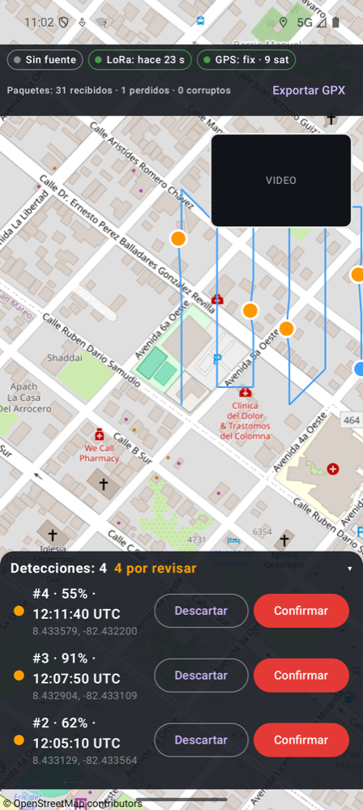
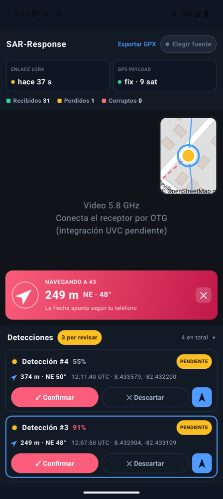

<p align="center">
  
  
</p>

# SAR-Response

**App Android de estación de tierra para drones de búsqueda y rescate (SAR) con IA a bordo.**
En el teléfono aparece instalada como **SAR**.

SAR-Response es la parte "en manos del rescatista" del proyecto *Universal Edge-AI Rescue
Payload for Low-Cost Search and Rescue Drones* (IEEE Response Quest 2026). El payload es un
módulo de bajo costo que se monta en cualquier dron: una CanMV K230 busca personas en la
imagen de la cámara con una red neuronal (YOLO) **dentro del dron, sin internet**, y cuando
encuentra a alguien envía un aviso por **LoRa** con su posición GPS. Al mismo tiempo, transmite
video analógico por **5.8 GHz**.

La app junta todo eso en una sola pantalla para que el operador pueda **ver dónde está el
dron, dónde se detectó a alguien, mirar el video, decidir** si la detección es real y
**guiar a quien va a pie** hasta esa persona.

<p align="center">
  
  &nbsp;&nbsp;
  
</p>

<p align="center"><sub>Capturas con la misión simulada (modo demo). Datos del mapa © colaboradores de OpenStreetMap.</sub></p>

---

## Índice

- [Por qué existe](#por-qué-existe)
- [Qué hace](#qué-hace)
- [Cómo se usa en campo](#cómo-se-usa-en-campo)
- [La pantalla, parte por parte](#la-pantalla-parte-por-parte)
- [Arquitectura del sistema](#arquitectura-del-sistema)
- [Protocolo de los paquetes LoRa](#protocolo-de-los-paquetes-lora)
- [Estructura del código](#estructura-del-código)
- [Compilar e instalar](#compilar-e-instalar)
- [Estación tierra (ESP32)](#estación-tierra-esp32)
- [Mapas sin internet](#mapas-sin-internet)
- [Modo demo](#modo-demo)
- [Permisos y privacidad](#permisos-y-privacidad)
- [Decisiones de diseño](#decisiones-de-diseño)
- [Limitaciones conocidas](#limitaciones-conocidas)
- [Trabajo futuro](#trabajo-futuro)
- [Contribuir](#contribuir)
- [Licencia](#licencia)

---

## Por qué existe

En una búsqueda real, el operador del dron no puede quedarse mirando el video sin parpadear
durante horas, y una persona en el suelo vista desde 40–60 m de altura ocupa apenas unos
pocos píxeles. La IA del payload no se cansa, pero tampoco es infalible. SAR-Response está
pensada para ese punto medio:

- **La IA propone, la persona decide.** Cada detección llega como *pendiente* y el operador
  la confirma o la descarta mirando el video y el contexto.
- **Funciona sin internet.** Zonas de desastre, montaña o selva rara vez tienen datos móviles.
  El enlace es LoRa + Bluetooth y siempre hay un mapa offline en el teléfono. Si hay internet,
  el mapa se carga **en línea** (mundo entero con detalle); si se corta, la app pasa sola al offline.
- **Hardware barato y común.** Un teléfono Android, un ESP32, un módulo LoRa E32 y un
  receptor de video FPV de los que se usan en drones de carreras.

## Qué hace

| Función | Detalle |
|---|---|
| **Mapa en vivo** | Recorrido del dron (línea azul), posición actual (punto azul), un pin por cada detección, la posición del operador (celeste) y una leyenda. Las detecciones pendientes "laten" para llamar la atención. |
| **Video 5.8 GHz** | Video del VTX del payload (con los recuadros de detección dibujados a bordo) desde un receptor FPV **UVC** conectado al teléfono por USB/OTG. Se lee directamente por USB, sin depender de que el teléfono soporte cámaras USB. |
| **Vistas intercambiables** | Video o mapa a pantalla completa, con la otra vista en miniatura (picture-in-picture). Tocar la miniatura las intercambia sin perder el zoom ni la posición del mapa; el botón **–** la oculta y **▣ Mostrar** la trae de vuelta. El video se puede **rotar** de a 90° y ver en **pantalla completa**. |
| **Detecciones** | Tarjetas con número, confianza de la IA (con color), hora UTC, coordenadas y **distancia y rumbo desde el operador** ("293 m · N 7°"). Botones **Confirmar** / **Descartar**. Las pendientes van primero. |
| **Navegar a una detección** | Banner con la distancia, el rumbo y una flecha que apunta hacia la persona **según hacia dónde mira el teléfono** (brújula), más una línea punteada en el mapa del operador al objetivo. |
| **Compartir coordenadas** | En una detección confirmada, envía por WhatsApp, SMS, correo, etc. un texto que se entiende sin la app: coordenadas, distancia y rumbo desde el operador, enlace a OpenStreetMap y enlace `geo:`. |
| **Avisos** | Cada detección nueva suena, vibra y muestra un mensaje con su confianza, distancia y dirección ("Detección #1 · 87% · 293 m N"), aunque el operador esté mirando el video. |
| **Protección contra toques equivocados** | La lista no se desplaza sola, y durante 0,8 s después de que se reordena (llegó una detección o se tomó una decisión) los botones no responden. Así un toque no cae en otra tarjeta. |
| **Salud del enlace** | Estado del Bluetooth con la estación tierra, tiempo desde el último paquete LoRa, fix y satélites del GPS del payload, y paquetes recibidos / perdidos / corruptos. |
| **Reconexión automática** | Si se cae el Bluetooth, la app reintenta sola (1 s, 2 s, 4 s… hasta 10 s). |
| **Búsquedas** | Cada búsqueda tiene nombre, **área dibujada sobre el mapa offline** (tocando sus esquinas) y **altura de vuelo planificada**: con ella y el FOV de la cámara del payload (fijo, 53,5°) la app calcula el ancho de barrido y **cuántos píxeles ocupa una persona** en la imagen del modelo, y avisa si la altura es demasiado alta para detectar bien. Se ve el borde del área, un aviso si el dron sale de ella y las detecciones fuera del área quedan marcadas. Todo se **guarda en el teléfono**: si Android cierra la app, la búsqueda vuelve tal cual; las anteriores se pueden abrir, exportar o borrar. |
| **Panel de la misión** | Pestaña **Panel** con indicadores calculados solo con datos reales: tiempo de misión, distancia volada, confirmadas / total, % de paquetes perdidos, **tiempo promedio de decisión del operador**, línea de tiempo de detecciones, pérdida de paquetes por tramo y mayor tiempo sin señal, distancias del equipo y registro de la misión. |
| **Exportar** | **GPX** con las detecciones confirmadas y pendientes (las descartadas no) y el recorrido del dron, para OsmAnd, Google Earth, QGIS, Garmin, etc. **CSV** con cada detección, su estado, cuándo llegó, cuándo se decidió, en cuántos segundos y a qué distancia del operador, para el informe posterior. |
| **Mapa en línea u offline** | Con internet, el mapa del mundo entero con detalle de calle se carga en línea (indicador **● En línea**). Sin internet, o si se corta, cambia solo al mapa del teléfono (**● Offline**). Se puede apagar el modo en línea en **Elegir fuente**. |
| **Mapa offline** | Mapa vectorial de OpenStreetMap con calles, lugares y nombres en español. Incluido: **mundo con poco detalle + Chiriquí con detalle de calle** (~34 MB). **Descargar mapa de una zona** desde la app (encuadras la zona y listo) o importar un `.pmtiles`. En campo no se descarga nada. |
| **Arranque listo** | Al abrir por primera vez, pide los permisos de ubicación y Bluetooth en una pantalla de bienvenida; luego el mapa arranca centrado en la posición del operador. |
| **Modo demo** | Misión simulada para probar y presentar la app sin dron ni radio. |
| **Español e inglés** | Toda la interfaz, los nombres del mapa, el texto para compartir, el CSV y el GPX en español o inglés. Se elige en **Elegir fuente → Idioma · Language** (Sistema / Español / English) o, en Android 13+, también en *Ajustes → Apps → SAR → Idioma*. |
| **Pantalla siempre encendida** | Mientras la app está abierta, el teléfono no se bloquea. |

## Cómo se usa en campo

1. **Antes de salir**
   - Si la búsqueda es fuera de Chiriquí, con internet: **Elegir fuente → Descargar mapa de una
     zona**, encuadra la zona en el mapa y **Descargar esta zona** ([ver abajo](#mapas-sin-internet)).
   - Abre la app con cielo despejado unos minutos antes: sin internet, el primer fix del GPS
     del teléfono puede tardar de 30 s a unos minutos.
   - Empareja una sola vez el teléfono con la estación tierra (**SAR-Estacion**) en
     *Ajustes → Bluetooth*.
2. **Crear la búsqueda**
   - Toca la barra **BÚSQUEDA** → **＋ Nueva búsqueda**: nombre y altura de vuelo.
     La app muestra el barrido y el tamaño de una persona en píxeles (✓ / ⚠).
   - **Dibujar área:** toca las esquinas del área en el mapa (mínimo 3) y **Crear búsqueda**.
     Ves la superficie mientras dibujas. También puedes crearla **sin área**.
3. **En el punto de despegue**
   - Enciende la estación tierra y el payload.
   - Abre SAR-Response, toca **Elegir fuente** (arriba a la derecha) y elige
     **SAR-Estacion**. Concede los permisos de Bluetooth y ubicación.
   - Espera a ver *Enlace LoRa* en verde y *GPS payload: fix* antes de despegar.
   - Conecta el receptor de video 5.8 GHz al teléfono por USB (OTG), pon el receptor en el
     canal del VTX (por ejemplo A3 = 5825 MHz) y **acepta el permiso USB** que muestra Android.
4. **Durante el vuelo**
   - Cuando suene una alerta, toca la detección en la lista: el mapa se centra en ella.
   - Mira el video y decide: **Confirmar** (pin rojo) o **Descartar** (pin gris).
5. **Para llegar a la persona**
   - Toca **➤ Navegar a** en la detección: la flecha del banner apunta hacia ella y la
     distancia se actualiza mientras caminas.
   - O toca **Compartir coordenadas** para mandárselas al equipo que va a pie.
6. **Al terminar**
   - En la barra **BÚSQUEDA**: **Exportar GPX / CSV** y **Terminar esta búsqueda**. Queda guardada
     en la lista de anteriores.

## La pantalla, parte por parte

### Encabezado (arriba)

| Indicador | Verde | Ámbar | Rojo | Gris |
|---|---|---|---|---|
| **Fuente** (botón arriba a la derecha) | Conectado a la estación tierra o a la demo | Conectando… | Reintentando tras una caída | Ninguna fuente elegida |
| **Enlace LoRa: hace N s** | Último paquete hace < 35 s | 35–65 s (se perdió un latido) | > 65 s: enlace con el dron probablemente caído | Aún no llega nada |
| **GPS payload** | El payload tiene fix | El payload no tiene fix (las alertas llegarán sin posición) | — | Sin latidos todavía |

Los umbrales de LoRa salen del latido del payload, que llega cada 30 s.

Debajo: **paquetes recibidos · perdidos · corruptos**.

La barra **BÚSQUEDA** muestra la búsqueda en curso y la superficie de su área; al tocarla se abre la
lista: exportar GPX/CSV, terminar, crear una nueva, o abrir/borrar una anterior. Si se conecta la estación
tierra o llega una **detección** sin ninguna búsqueda abierta, la app crea una automáticamente
(conservando la detección) para no perder nada.
- *Perdidos* se calcula con el número de secuencia: si después del 41 llega el 44, se
  perdieron 2.
- *Corruptos* son líneas con checksum inválido o mal formadas (ruido de radio).

Tener dos indicadores separados (Bluetooth y LoRa) permite saber **dónde** está el problema:
entre el teléfono y la estación, o entre la estación y el dron.

### Vista principal y miniatura

- **Mapa**:
  - Línea azul: recorrido del dron.
  - Punto azul grande: última posición conocida.
  - Punto celeste: el operador (el teléfono).
  - Pines: 🟠 pendiente (con un halo que late) · 🔴 confirmada · ⚪ descartada. El seleccionado
    lleva un anillo azul.
  - Línea roja punteada: del operador a la detección hacia la que se está navegando.
  - Tocar un pin lo selecciona en la lista.
- **Banner de navegación** (abajo del mapa): distancia, punto cardinal, grados y una flecha.
  - Si el teléfono tiene brújula, la flecha apunta hacia la persona **según hacia dónde mira el
    teléfono**: basta con girar hasta que apunte hacia adelante y caminar.
  - Sin brújula, el rumbo se da respecto al norte, y el banner lo indica.
- **Video**: imagen del VTX del payload. Si no hay receptor conectado, la vista lo indica
  ("Conecta el receptor…", "Acepta el permiso USB…") y el resto de la app sigue funcionando.
- **Miniatura** (arriba a la derecha): tócala para intercambiar mapa y video; **–** la oculta y
  **▣ Mostrar mapa / video** la vuelve a mostrar.
- **Video grande:** **⟳** lo gira de a 90° (girado aprovecha el alto del teléfono en vertical) y
  **⤢ Completa** oculta el encabezado y la lista.
- **Grabar:** **● REC** graba el video tal como llega del receptor (MP4 H.264, 1080p, sin audio,
  ≈ 0,9 GB por hora) en **Movies/SAR** del teléfono, con el nombre de la búsqueda. Mientras graba,
  el botón muestra **■ mm:ss** (tócalo para terminar) y la miniatura dice **● REC**. Sigue grabando
  si sales un momento de la app (por ejemplo, para compartir una detección); si se desconecta el
  receptor, el archivo se cierra con lo grabado hasta ahí. Sirve como evidencia y para revisar
  después las detecciones con calma.

### Pestañas Operación / Panel

Arriba a la izquierda. **Operación** es la vista de trabajo (mapa, video y detecciones).
**Panel** muestra el resumen de la misión; el mapa sigue cargado debajo, así que al volver
conserva el zoom y la posición.

| Tarjeta del panel | Qué muestra y de dónde sale |
|---|---|
| Tiempo de misión / Distancia volada | Desde que se **creó la búsqueda** hasta que se termina (sin búsqueda no corre, aunque el payload ya mande latidos); suma del recorrido según el GPS del payload. |
| Confirmadas / Paquetes perdidos | Confirmadas sobre el total; % perdido según los saltos de secuencia (verde < 5 %, ámbar < 15 %, rojo). |
| Detecciones | Pendientes, confirmadas y descartadas, y el **tiempo promedio que tarda el operador en decidir**. |
| Línea de tiempo | Cada detección según el momento en que llegó y su confianza (50–100 %), con el color de su estado. |
| Calidad del enlace | Último paquete, **mayor silencio** y pérdida por tramo de la misión; un tramo gris punteado significa que no llegó nada. |
| Equipo | Distancia del operador al dron y a cada detección activa. |
| Registro de misión | Primer paquete, detecciones recibidas, decisiones (con cuánto tardaron) y silencios de más de 45 s. |

La primera tarjeta es la **búsqueda**: superficie del área, ancho de barrido, detecciones fuera del
área y **% del área cubierta (estimado)**. La cobertura cuenta qué parte del área quedó a menos de
medio ancho de barrido del recorrido del dron; es una estimación que supone cámara hacia abajo y
altura constante.

**Altura, barrido y tamaño de la persona.** Con la cámara hacia abajo, el ancho de terreno visto es
`2 × altura × tan(FOV/2)`. El modelo recibe la imagen reducida a 640 px de ancho, así que una persona
de tamaño `s` ocupa `s × 640 / barrido` píxeles. El modelo se entrenó con personas de unos 13×16 px;
por debajo de ~12 px la detección cae, y la app lo advierte. El **FOV es fijo, 53,5°**: la cámara
del payload es la Raspberry Pi v1.3 (OV5647, módulo P5V04A) en modo **1280×960**, que usa el sensor
completo (53,5° × 41,4°). Si se cambia de modo o de lente, se cambia `DEFAULT_HFOV_DEGREES` en
`CameraGeometry.kt`.

### Panel de detecciones (abajo)

- El encabezado muestra el total y cuántas están **por revisar**. Tócalo para plegar o desplegar.
- Cada tarjeta muestra el número, la confianza de la IA y su estado; debajo, la distancia y el
  rumbo desde el operador, la hora UTC y las coordenadas.
- **Confianza con color:** ≥ 80 % rosado (alta), 60–79 % ámbar (media), < 60 % gris (baja; mírala con
  más cuidado en el video).
- Botones según el estado:
  - Pendiente: **✓ Confirmar**, **✕ Descartar** y **➤** (navegar).
  - Confirmada: **➤ Navegar a** y **Compartir coordenadas**.
- Tocar una tarjeta centra el mapa en esa detección. Si estabas viendo el video, cambia al mapa.
- Las pendientes siempre van arriba. Después de cada decisión la lista vuelve arriba, donde quedan
  las que faltan revisar. Si hay tarjetas fuera de la vista, aparece **↑ Ver más**.

## Arquitectura del sistema

```
                 ┌─────────────── DRON (payload) ───────────────┐
                 │  Cámara → CanMV K230 (YOLO INT8, ~12 FPS)      │
                 │     │  GPS ──┘                                 │
                 │     ├─ UART → E32 LoRa 915 MHz ───────────────────────┐
                 │     └─ UART → ESP32 (dibuja recuadros) → VTX 5.8 GHz ─┼──┐
                 └────────────────────────────────────────────────┘     │  │
                                                                         │  │
                 ┌──────────── ESTACIÓN TIERRA ────────────┐            │  │
                 │  E32 LoRa ◄─────────────────────────────────────────┘  │
                 │     ├─► ESP32 ── Bluetooth SPP ──────────────┐         │
                 │     └─► YP-05 (USB) → PC (opcional)          │         │
                 └──────────────────────────────────────────────┘         │
                                                               ▼          │
                 ┌──────────── TELÉFONO ANDROID ───────────────────┐      │
                 │  SAR-Response  ◄── OTG ── receptor UVC 5.8 GHz ◄──────┘
                 └─────────────────────────────────────────────────┘
```

- **Datos (LoRa → Bluetooth):** pocos bytes, gran alcance y bajo consumo. Llevan lo que la
  app necesita para decidir: qué, dónde y cuándo.
- **Video (5.8 GHz analógico):** latencia muy baja y sin pantallas congeladas por pérdida de
  paquetes, como pasa con el video digital. Sirve para que una persona verifique lo que
  detectó la IA.

## Protocolo de los paquetes LoRa

Texto ASCII, una línea por paquete, terminada en `\r\n`, con checksum XOR estilo NMEA. Cada
paquete cabe en un solo envío de la E32 (< 58 bytes).

```
$SAR,<unidad>,<seq>,<lat>,<lon>,<confianza>,<hhmmss>*CS            persona detectada
$SAH,<unidad>,<seq>,<lat>,<lon>,<satélites>,<hhmmss>,<vbat>*CS     latido (cada 30 s)
$SAB,<unidad>,<seq>,<vbat>*CS                                       batería baja (< 6,8 V)
```

| Campo | Descripción |
|---|---|
| `unidad` | Identificador del payload (p. ej. `A1`). Permite varios drones en el mismo canal. |
| `seq` | Contador 0–65535 compartido por todos los tipos; vuelve a 0 después de 65535. |
| `lat`, `lon` | Grados decimales (6 decimales ≈ 10 cm). **Vacíos** si el GPS no tiene fix. |
| `confianza` | 0.00–1.00, solo en `$SAR`. |
| `satélites` | Satélites en uso, solo en `$SAH`. |
| `hhmmss` | Hora UTC del GPS (vacía sin fix). |
| `vbat` | Voltaje de la batería del payload (pack 2S): 1 decimal en `$SAH`, 2 decimales en `$SAB`. En `$SAH` es **opcional**: también se acepta el latido de 7 campos del firmware anterior. |
| `CS` | XOR de todos los caracteres entre `$` y `*`, en dos dígitos hexadecimales. |

Ejemplos reales recibidos por la estación tierra:

```
$SAH,A1,0,,,0,,7.6*29        latido sin fix de GPS, batería 7,6 V
$SAB,A1,0,4.25*21            aviso de batería baja: 4,25 V
$SAR,A1,2,-12.046410,-77.042810,0.87,120041*1E
```

Cómo trata la app los paquetes:
- **Checksum inválido, tipo desconocido o cantidad de campos incorrecta:** se descarta y suma a
  *corruptos*.
- **Repetido** (mismo `seq` que el anterior): se ignora.
- **Salto de secuencia:** cuenta como paquetes perdidos. Un salto mayor a 1000 se interpreta
  como un reinicio del payload, no como miles de pérdidas.
- **Coordenadas fuera de rango:** el paquete se rechaza.
- **Batería:** el último voltaje se muestra en el encabezado (**BATERÍA**: verde ≥ 7,4 V, ámbar,
  rojo < 6,8 V) y en el panel. Un `$SAB` muestra un **aviso rojo fijo** arriba de todas las vistas,
  con sonido y vibración, y queda en el registro de la misión. El aviso se apaga al tocar
  *Entendido* o cuando un latido vuelve a mostrar un voltaje normal (batería cambiada).

## Estructura del código

```
SAR-Response/
├── core/                      Kotlin puro (sin Android), con pruebas
│   └── src/main/kotlin/.../core/
│       ├── Packet.kt          Modelo de paquetes + PacketCodec (parse/format/checksum)
│       ├── MissionTracker.kt  Estado de la misión: detecciones, recorrido, estadísticas
│       ├── LinkSource.kt      Interfaz de cualquier origen de datos (Flow<String>)
│       ├── ReplaySource.kt    Misión simulada para demos
│       ├── GpxExporter.kt     Exportación GPX 1.1
│       ├── MissionStats.kt    Indicadores del panel, registro de misión y exportación CSV
│       ├── SearchArea.kt      Búsqueda y su área: superficie, contiene/no contiene, cobertura
│       ├── CameraGeometry.kt  Altura → ancho de barrido → píxeles de una persona
│       └── map/               PMTiles: formato, recortador por zonas y CLI para el mapa incluido
│       └── Geo.kt             Distancia, rumbo, punto cardinal y desplazamientos
├── app/                       Aplicación Android (Jetpack Compose)
│   └── src/main/java/.../sarresponse/
│       ├── MainActivity.kt    Permisos, elección de fuente, avisos, exportación
│       ├── MissionViewModel.kt Conexión con reintentos, búsquedas y guardado automático
│       ├── data/SearchStore.kt Búsquedas guardadas como JSON en el teléfono
│       ├── link/BluetoothSppSource.kt  Bluetooth clásico (RFCOMM/SPP)
│       └── ui/
│           ├── Dashboard.kt   Barra de estado, intercambio video/mapa, panel de detecciones
│           ├── MapPane.kt     Mapa MapLibre: capas de recorrido, pines, operador y navegación
│           ├── OfflineMap.kt  Archivo .pmtiles local, importación/descarga y estilo
│           ├── OnlineMap.kt   Mapa en línea y detección de conexión (cambio automático)
│           ├── AppLanguage.kt Idioma de la app (Sistema / Español / English)
│           ├── Panel.kt       Pestaña Panel: indicadores, gráficos y registro
│           ├── SearchDialogs.kt Lista de búsquedas y "Nueva búsqueda"
│           ├── Sensors.kt     Ubicación del operador y brújula del teléfono
│           └── VideoPane.kt   Vista del video del receptor
│       └── video/UsbVideo.kt  Receptor FPV UVC por USB: permiso, apertura, grabación
├── app/src/main/res/values*/  Textos: español (values) e inglés (values-en)
├── app/src/main/assets/mapa/  Estilos del mapa (es/en), letras e íconos (y region.pmtiles, generado)
├── tools/mapa/                Scripts para generar el mapa offline y su estilo
├── firmware/esp32-bt-bridge/  Sketch Arduino del puente LoRa → Bluetooth
└── docs/img/                  Capturas para este README
```

**¿Por qué `core/` está separado?** Toda la lógica que no depende del teléfono (interpretar
paquetes, contar pérdidas, decidir qué exportar) vive en un módulo Kotlin puro. Así:
- se prueba en segundos sin emulador (`./gradlew :core:test`);
- se puede reutilizar en una futura app de escritorio con Kotlin Multiplatform, que leería la
  estación tierra por USB (YP-05) en lugar de Bluetooth.

Para agregar un nuevo origen de datos, basta con implementar `LinkSource`:

```kotlin
interface LinkSource {
    val label: String
    fun lines(): Flow<String>   // una línea por paquete; termina o falla si se cae el enlace
}
```

**Tecnologías:** Kotlin 2.4 · Jetpack Compose (Material 3) · Coroutines/StateFlow ·
[UVCAndroid](https://github.com/shiyinghan/UVCAndroid) (video USB) ·
[MapLibre Native](https://maplibre.org) + [PMTiles](https://protomaps.com) · Android Gradle Plugin 9 · minSdk 26 (Android 8.0).

## Compilar e instalar

Requisitos: Android Studio reciente (con AGP 9) y JDK 17 o superior. El mapa incluido no se sube al
repositorio por su tamaño: genéralo una vez con `tools/mapa/descargar_mapa.sh` (ver
[Mapas sin internet](#mapas-sin-internet)). Si no lo generas, la app compila igual: arranca sin
mapa base y puedes descargar uno desde la propia app.

```bash
git clone https://github.com/DaiYukichi/SAR-Response.git
cd SAR-Response
./gradlew :core:test           # pruebas del núcleo
./gradlew :app:assembleDebug   # APK en app/build/outputs/apk/debug/
./gradlew :app:installDebug    # instala en el teléfono conectado por USB
```

O simplemente abre la carpeta en Android Studio y presiona *Run*.

## Estación tierra (ESP32)

El sketch [`firmware/esp32-bt-bridge`](firmware/esp32-bt-bridge/esp32-bt-bridge.ino) convierte
un ESP32 en un puente: todo lo que recibe la E32 lo reenvía por Bluetooth al teléfono, y
también por USB para depurar.

| E32 | ESP32 |
|---|---|
| TXD | GPIO16 (RX2), configurable en el sketch |
| RXD | sin conectar |
| M0, M1 | GND (modo normal) |
| GND | GND |
| VCC | 5 V |

- Se necesita un ESP32 con **Bluetooth clásico** (ESP32-WROOM/WROVER). Los S2, S3 y C3 solo
  tienen BLE y no sirven para este sketch.
- Probado con el core ESP32 de Arduino 2.0.x.
- La E32 de tierra debe estar en el **mismo canal y velocidad de aire** que la del payload
  (en este proyecto: 915 MHz, 2.4 kbps, 9600 8N1).
- Un adaptador USB-serie (p. ej. YP-05) puede escuchar en paralelo la misma línea TXD para
  registrar en una PC. Solo un dispositivo debe manejar la línea RXD de la E32.

## Mapas sin internet

El mapa es **vectorial**: datos de OpenStreetMap (vía [Protomaps](https://protomaps.com)) en
formato `.pmtiles`, dibujados con [MapLibre](https://maplibre.org) con el mismo estilo oscuro en
español, sea en línea u offline. Las letras y los íconos del mapa van dentro de la app.

- **En línea (si hay internet y la opción está activa):** se lee el mapa base mundial directamente
  de internet, pidiendo solo las teselas que se ven. La app vigila la conexión: si se pierde, pasa
  al mapa offline; si vuelve, regresa al en línea. Abajo a la derecha del mapa se indica cuál se usa.
- **Offline:** el mapa guardado en el teléfono. Fuera de la zona con detalle solo existe el mundo
  general: si el mapa se ve vacío, alejarlo (o descargar esa zona antes de salir).

- **Incluido:** el **mundo con poco detalle** (países, ciudades, carreteras principales; ~15 MB)
  para ubicarse en cualquier parte, más **Chiriquí con detalle de calle** (~19 MB). Al primer
  arranque se copia al almacenamiento interno; por eso la primera vez tarda unos segundos.
- **Descargar otra zona desde la app (plug and play):** con internet, antes de salir,
  **Elegir fuente → Descargar mapa de una zona (requiere internet)**. Mueves y acercas el mapa
  hasta encuadrar la zona y tocas **Descargar esta zona**: la app baja **solo esa zona** con detalle
  de calle (más el mundo general), con progreso y opción de cancelar. Si la zona es muy grande,
  baja automáticamente el nivel de detalle para no pasar de ~90 MB.
- **Importar:** **Importar mapa (.pmtiles)…** carga un archivo que ya esté en el teléfono.
  **Volver al mapa incluido** deshace la descarga o importación.
- **Sin ningún mapa:** la app sigue funcionando; recorrido, pines, distancias y navegación se
  dibujan sobre un fondo liso.

### Cómo funciona la descarga

El mapa base diario de Protomaps es un único archivo PMTiles del planeta (~120 GB). La app no lo
baja: lee su índice y pide por HTTP (`Range`) **solo los bytes de las teselas de la zona**, y arma
con ellas un PMTiles nuevo y válido (`core/map/MapExtractor.kt`). Es el mismo resultado que
`pmtiles extract`, verificado con `pmtiles verify` y con una prueba que compara tesela por tesela.

> Se usan las builds públicas de `build.protomaps.com` (se guardan las de la última semana). Para
> uso en producción conviene alojar una copia propia del mapa base y cambiar la URL.
> No se usan los servidores de teselas de OpenStreetMap: su
> [política](https://operations.osmfoundation.org/policies/tiles/) prohíbe las descargas masivas.

### Generar el mapa incluido (en la computadora)

```bash
tools/mapa/descargar_mapa.sh                              # mundo + Chiriquí (por defecto)
tools/mapa/descargar_mapa.sh "-82.52,8.36,-82.35,8.50"    # mundo + otra zona: oeste,sur,este,norte
```

Usa el mismo recortador de la app (no requiere herramientas externas) y deja el resultado en
`app/src/main/assets/mapa/region.pmtiles`, que se empaqueta al compilar. El estilo del mapa (tema
oscuro, etiquetas en español) se genera con `cd tools/mapa && npm install && npm run estilo`.

## Modo demo

En el selector de fuente, **Demo (misión simulada)** crea una búsqueda "Demo" con su área y reproduce
una misión de unos 80 segundos:

- el dron barre el área en pasadas paralelas (patrón de "cortadora de césped"),
- llegan latidos con posición y 4 detecciones con distintas confianzas,
- se simula la pérdida de un paquete, que aparece en el contador de *perdidos*,
- el operador queda en un punto de despegue simulado al suroeste del área, para que la
  distancia, el rumbo y "Navegar a" funcionen sin GPS. La brújula sí es la real del teléfono.

Sirve para entrenar a operadores, probar la interfaz y presentar el proyecto sin hardware.
Las coordenadas de la demo son un punto genérico en David, Chiriquí (Panamá), y se pueden
cambiar en `ReplaySource.kt`.

## Permisos y privacidad

| Permiso | Para qué |
|---|---|
| Bluetooth (conectar) | Hablar con la estación tierra. |
| Ubicación | Posición del operador: punto en el mapa, distancia y rumbo a cada detección y "Navegar a". Si se niega, todo lo demás funciona. |
| Internet / estado de red | **Solo** para el mapa: verlo en línea cuando hay conexión (se puede apagar) y "Descargar mapa de una zona". Nada más usa la red: los datos del dron, las detecciones y las decisiones nunca salen del teléfono, y no hay servidores, cuentas ni analíticas. |
| Cámara | **Solo** para leer el receptor de video USB: Android exige este permiso para abrir cualquier cámara USB. La app no usa las cámaras del teléfono. |
| Vibración | Avisar de nuevas detecciones. |

- **Sin internet en campo, por diseño.** Ninguna función de la operación depende de la red. Internet
  solo se usa para mostrar o descargar el **mapa**; las detecciones y las posiciones no se envían a
  ningún lado.
- **Todo se queda en el teléfono.** La app no tiene servidor, cuentas, analíticas ni
  publicidad. Los datos solo salen si el operador exporta un GPX o comparte una detección.
- **El payload no transmite imágenes de personas por LoRa**, solo coordenadas, confianza y hora.
- **Decisión humana obligatoria.** La app nunca trata una detección como confirmada por sí
  sola. Cada confirmación o descarte guarda su hora para poder revisar la operación después.

## Decisiones de diseño

- **Bluetooth clásico (SPP) en vez de BLE:** es el camino más simple y robusto para un flujo
  de texto línea a línea desde un ESP32. BLE queda como opción si en el futuro hay app de iOS.
- **Video analógico en vez de digital:** latencia de pocos milisegundos y degradación
  gradual (con nieve en la imagen) en vez de congelarse.
- **Texto legible en vez de binario:** los paquetes se pueden leer con cualquier terminal
  serie, lo que facilita depurar en campo. Caben igual en un envío de la E32.
- **Interfaz oscura y de alto contraste:** se lee mejor al sol y gasta menos batería en
  pantallas OLED.
- **La lista nunca se mueve bajo el dedo:** confirmar o descartar la tarjeta equivocada en una
  búsqueda real es grave, así que se evita el desplazamiento automático y se bloquean los botones
  un instante tras cada reordenamiento.
- **Compartir como texto plano:** lo entiende cualquier persona en cualquier app, incluso sin
  SAR-Response instalada.
- **Recortar el mapa nosotros mismos:** descargar solo los bytes de la zona (en vez de un
  archivo por país preparado de antemano) permite bajar *cualquier* zona del mundo sin servidor
  propio, y unir "mundo general + detalle" en un solo archivo.
- **Mapa vectorial en vez de imágenes:** Chiriquí entero pesa ~20 MB, se ve nítido a cualquier
  zoom y los nombres se pueden mostrar en español.
- **Mapa y video siempre montados:** al intercambiarlos solo cambia su tamaño, así el mapa no
  se recarga ni pierde el zoom.

## Limitaciones conocidas

- Receptor usado: "RXC FPV receiver" 5.8 GHz (chip MacroSilicon), salida UVC MJPEG 1920×1080;
  probado en un POCO con Android 16. **La grabación todavía no se probó con el receptor real.**
- El video grabado no tiene marcas de tiempo por detección: para cruzarlo con las detecciones se
  usa la hora de inicio del archivo y la hora de cada detección del CSV.
- El % de área cubierta es una estimación: depende del ancho de barrido que ingresa el operador.
- La posición de una detección es la del GPS del **dron** en ese momento, no la proyección
  exacta del píxel al suelo. A 40–60 m de altura el error puede ser de varios metros.
- La brújula del teléfono indica el norte **magnético**; la diferencia con el norte geográfico
  es pequeña en Panamá (unos 2°), pero en otras regiones puede ser mayor. Además, las brújulas de
  los teléfonos se descalibran cerca de metales: si la flecha no tiene sentido, haz un "8" con el
  teléfono.
- El mapa incluido tiene detalle hasta nivel de calle (zoom 15); más cerca se amplía el mismo
  detalle. No incluye imágenes satelitales.
- El APK de depuración pesa ~80 MB porque incluye el mapa y el motor de mapas para todos los
  tipos de procesador; una versión de publicación por procesador pesa bastante menos.
- La distancia y el rumbo son en línea recta; no consideran el terreno ni los caminos.
- La app asume una sola estación tierra a la vez.

## Trabajo futuro

La app actual cubre el ciclo completo **detectar → verificar → decidir → guiar**. Lo que sigue
está diseñado (parte de ello en un mockup interactivo), pero **todavía no se puede implementar**
porque depende de hardware o radios que el prototipo no tiene. Se documenta aquí como la
dirección del proyecto.

### A corto plazo (solo software)

- [x] ~~Video 5.8 GHz dentro de la app con el receptor UVC por OTG~~ (hecho y probado con el
      receptor real).
- [x] ~~Grabar el video de la misión~~ (hecho: MP4 en Movies/SAR).
- [ ] Marcar las detecciones dentro del video grabado (capítulos o subtítulos con la hora de cada
      una) y reproducirlo en la app junto al mapa.
- [x] ~~Búsquedas separadas y delimitadas, guardadas en el teléfono~~ (hecho).
- [ ] Ver una búsqueda anterior en modo solo lectura (hoy, abrirla la retoma).
- [x] ~~Usar el modo 4:3 con el sensor completo de la OV5647~~ (hecho: 1280×960, FOV 53,5°).
- [ ] Alojar una copia propia del mapa base para las descargas, en vez de las builds públicas.
- [ ] **Altura real en vuelo:** agregar la altura relativa al despegue al latido `$SAH` (GPS o
      barómetro) para que la cobertura use la altura medida y no la planificada.
- [ ] **Recall según tamaño en píxeles** a partir de la evaluación del modelo en la K230, para que
      el umbral de altura salga de datos propios y no de un valor supuesto.
- [ ] **Notas por detección** (p. ej. "persona herida", "requiere camilla").
- [ ] **Tema claro** como alternativa al oscuro.
- [ ] Varios drones a la vez (campo `unidad`) con colores distintos.
- [x] ~~Traducción al inglés~~ (hecho: interfaz, mapa, compartir, CSV y GPX).
- [ ] **App de escritorio** con Kotlin Multiplatform reutilizando `core/` y la estación tierra por USB.

### Red de rescate en campo (requiere nuevo hardware)

La idea es que el sistema no termine en el teléfono del operador, sino que llegue hasta quien
camina hacia la víctima.

- [ ] **SAR-Beacon, la vista del rescatista:** un nodo de mano (ESP32 + E32 + GPS + pantalla)
      que muestra una flecha, la distancia y el rumbo hacia la detección que el operador le
      asignó, con un botón **"Voy en camino"**.
- [ ] **Enviar al equipo de tierra por radio:** desde una detección confirmada, el operador
      asigna el objetivo a un rescatista concreto, sin depender de datos móviles.
- [ ] **Nodos multi-rol:** el mismo firmware cumple distintos papeles según su identificador:
      `A#` dron · `G#` tierra / rescatista · `R#` repetidor.
- [ ] **Emparejamiento por QR** entre la app y cada nodo.
- [ ] **Nuevos paquetes** en el mismo formato de texto con checksum:
      - `$SAG` *go-to*: el operador asigna un objetivo a un rescatista.
      - `$SGP` posición periódica del rescatista (aparece en el mapa del operador).
      - `$SGA` confirmación (*ack*) de que el rescatista recibió la orden.
- [ ] **Malla por inundación (*flooding*)** para cubrir quebradas y laderas sin línea de vista:
      cada paquete lleva origen, secuencia y TTL; los nodos descartan duplicados y los
      repetidores (`R#`) retransmiten.

### Mejoras de precisión

- [ ] Proyectar la detección al suelo usando la altura del dron y la orientación de la cámara,
      en vez de usar la posición del dron.
- [ ] Corregir la declinación magnética de la brújula.
- [ ] Rutas a pie sobre el terreno (curvas de nivel, senderos) en vez de línea recta.

## Contribuir

Se aceptan *issues* y *pull requests*. Si cambias algo en `core/`, agrega o actualiza las
pruebas y verifica que `./gradlew :core:test` pase. Si cambias el protocolo, actualiza
también el firmware del payload y la sección [Protocolo](#protocolo-de-los-paquetes-lora).

## Licencia

Código bajo licencia [Apache-2.0](LICENSE).

- Datos de mapas © [colaboradores de OpenStreetMap](https://www.openstreetmap.org/copyright),
  licencia ODbL, procesados por [Protomaps](https://protomaps.com).
- Video USB: [UVCAndroid](https://github.com/shiyinghan/UVCAndroid) (Apache-2.0), que incluye
  libuvc (BSD), libusb (LGPL-2.1, enlazada dinámicamente) y libjpeg-turbo (BSD/IJG).
- Letras Noto Sans: [SIL Open Font License](app/src/main/assets/mapa/licencias/fuentes-OFL.txt).
- Ícono de la app, pantalla de arranque y logo: diseño "Baliza", "Radar" y "Monocromática"
  generado con Dia para este proyecto.
- Íconos del mapa: derivados de [tangrams/icons](https://github.com/tangrams/icons), licencia
  [MIT](app/src/main/assets/mapa/licencias/iconos-MIT.md).
