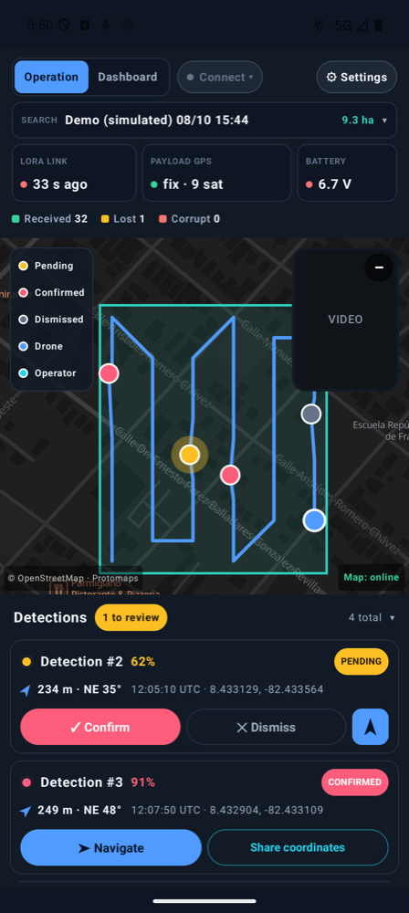
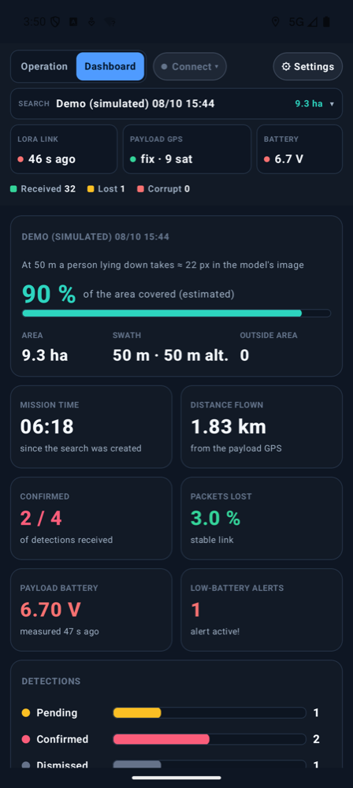

<p align="center">
  
  
</p>

# SAR-Response

**English** · [Español](README.es.md)

**Android ground-station app for search and rescue (SAR) drones with on-board AI.**
It installs on the phone as **SAR**.

SAR-Response is the "in the rescuer's hands" part of the project *Universal Edge-AI Rescue
Payload for Low-Cost Search and Rescue Drones* (IEEE Response Quest 2026). The payload is a
low-cost module that mounts on any drone: a CanMV K230 looks for people in the camera image
with a neural network (YOLO) **on board, without internet**, and when it finds someone it sends
an alert over **LoRa** with its GPS position. At the same time it transmits analog video over
**5.8 GHz**.

The app brings all of that onto one screen so the operator can **see where the drone is,
where someone was detected, watch the video, decide** whether the detection is real, and
**guide the people on foot** to that person.

<p align="center">
  
  &nbsp;&nbsp;
  
</p>

<p align="center"><sub>Screenshots taken with the simulated mission (demo mode). Map data © OpenStreetMap contributors.</sub></p>

---

## Contents

- [Why it exists](#why-it-exists)
- [What it does](#what-it-does)
- [How to use it in the field](#how-to-use-it-in-the-field)
- [The screen, piece by piece](#the-screen-piece-by-piece)
- [System architecture](#system-architecture)
- [LoRa packet protocol](#lora-packet-protocol)
- [Code structure](#code-structure)
- [Build and install](#build-and-install)
- [Ground station (ESP32)](#ground-station-esp32)
- [Maps without internet](#maps-without-internet)
- [Demo mode](#demo-mode)
- [Permissions and privacy](#permissions-and-privacy)
- [Design decisions](#design-decisions)
- [Known limitations](#known-limitations)
- [Future work](#future-work)
- [Contributing](#contributing)
- [License](#license)

---

## Why it exists

In a real search, the drone operator cannot stare at the video without blinking for hours, and
a person on the ground seen from 40–60 m up covers only a few pixels. The payload's AI does not
get tired, but it is not infallible either. SAR-Response is built for that middle ground:

- **The AI proposes, the human decides.** Every detection arrives as *pending* and the operator
  confirms or dismisses it by looking at the video and the context.
- **Works without internet.** Disaster zones, mountains and jungle rarely have mobile data.
  The link is LoRa + Bluetooth and there is always an offline map on the phone. If there is
  internet, the map loads **online** (whole world in detail); if it drops, the app switches to
  the offline map by itself.
- **Cheap, common hardware.** An Android phone, an ESP32, an E32 LoRa module and an FPV video
  receiver like the ones used on racing drones.

## What it does

| Feature | Details |
|---|---|
| **Live map** | Drone track (blue line), current position (blue dot), one pin per detection, the operator's position (cyan) and a legend. Pending detections "pulse" to draw attention. |
| **5.8 GHz video** | Video from the payload's VTX (with the detection boxes drawn on board) from a **UVC** FPV receiver plugged into the phone over USB/OTG. It is read directly over USB, without relying on the phone supporting USB cameras. |
| **Swappable views** | Video or map full size, with the other one as a thumbnail (picture-in-picture). Tapping the thumbnail swaps them without losing the map's zoom or position; **–** hides it and **▣ Show** brings it back. The video can be **rotated** in 90° steps and shown **full screen**. |
| **Video recording** | **● REC** records the incoming video to an MP4 in **Movies/SAR**, named after the search. |
| **Detections** | Cards with number, AI confidence (color-coded), UTC time, coordinates and **distance and bearing from the operator** ("293 m · N 7°"). **Confirm** / **Dismiss** buttons. Pending ones come first. |
| **Navigate to a detection** | Banner with distance, bearing and an arrow pointing at the person **according to where the phone is facing** (compass), plus a dashed line on the map from the operator to the target. |
| **Share coordinates** | On a confirmed detection, sends via WhatsApp, SMS, email, etc. a text that makes sense without the app: coordinates, distance and bearing from the operator, an OpenStreetMap link and a `geo:` link. |
| **Alerts** | Every new detection beeps, vibrates and shows a message with its confidence, distance and direction ("Detection #1 · 87% · 293 m N"), even while the operator is watching the video. |
| **Protection against mistaps** | The list never scrolls by itself, and for 0.8 s after it reorders (a detection arrived or a decision was made) the buttons do not respond, so a tap never lands on another card. |
| **Link health** | Bluetooth status with the ground station, time since the last LoRa packet, payload GPS fix and satellites, payload battery, and received / lost / corrupt packets. |
| **Automatic reconnection** | If Bluetooth drops, the app retries by itself (1 s, 2 s, 4 s… up to 10 s). |
| **Payload battery** | Last voltage of the payload's 2S pack in the header and the dashboard. A `$SAB` low-battery packet shows a fixed red warning on every view, with sound and vibration. |
| **Searches** | Each search has a name, an **area drawn on the map** (tapping its corners) and a **planned flight altitude**: with it and the payload camera's FOV (fixed, 53.5°) the app computes the swath width and **how many pixels a person covers** in the model's image, and warns when the altitude is too high to detect well. The area's border is shown, there is a warning if the drone leaves it, and detections outside the area are flagged. Everything is **saved on the phone**: if Android kills the app, the search comes back as it was; previous searches can be opened, exported or deleted. The current search's area can be **drawn later or redrawn** (search bar → Draw / Redraw area) without losing what was received; if it has none, the bar shows **＋ area**. |
| **Mission dashboard** | **Dashboard** tab with indicators computed only from real data: mission time, distance flown, confirmed / total, % of lost packets, **average operator decision time**, detection timeline, packet loss per mission segment and longest silence, team distances and the mission log. |
| **Export** | **GPX** with confirmed and pending detections (not dismissed ones) and the drone track, for OsmAnd, Google Earth, QGIS, Garmin, etc. **CSV** with each detection, its status, when it arrived, when it was decided, how many seconds that took and how far it was from the operator, for the after-action report. |
| **Online or offline map** | With internet, the world map with street detail loads online (indicator **Map: online**). Without internet, or if it drops, it switches by itself to the map stored on the phone (**Map: offline**). Online mode can be turned off in **⚙ Settings**. |
| **Offline map** | OpenStreetMap vector map with streets, places and names in Spanish or English. Bundled: **low-detail world + Chiriquí (Panama) with street detail** (~34 MB). **Download a map area** from the app (frame the area and that's it) or import a `.pmtiles` file. Nothing is downloaded in the field. |
| **Ready on launch** | On first launch it asks for location, Bluetooth and camera (for the USB receiver) permissions on a welcome screen; then the map starts centered on the operator's position. |
| **Demo mode** | Simulated mission to try out and present the app without a drone or radio. |
| **Spanish and English** | The whole interface, map labels, shared text, CSV and GPX in Spanish or English. Chosen in **⚙ Settings → Idioma · Language** (System / Español / English) or, on Android 13+, also in *Settings → Apps → SAR → Language*. |
| **Screen always on** | While the app is open, the phone does not lock. |

## How to use it in the field

1. **Before leaving**
   - If the search is outside Chiriquí, with internet: **⚙ Settings → Download a map area**,
     frame the area on the map and **Download this area** ([see below](#maps-without-internet)).
   - Open the app under open sky a few minutes beforehand: without internet, the phone's first
     GPS fix can take from 30 s to a few minutes.
   - Pair the phone with the ground station (**SAR-Estacion**) once, in *Settings → Bluetooth*.
2. **Create the search**
   - Tap the **SEARCH** bar → **＋ New search**: name and flight altitude. The app shows the
     swath and a person's size in pixels (✓ / ⚠).
   - **Draw area:** tap the area's corners on the map (at least 3) and **Create search**. You
     see the surface while drawing. You can also create it **without an area** and draw it later.
3. **At the take-off point**
   - Turn on the ground station and the payload.
   - Open the app, tap **Connect ▾** (next to the tabs) and choose **SAR-Estacion**. Grant the
     Bluetooth and location permissions.
   - Wait until *LoRa link* is green and *Payload GPS: fix* before taking off.
   - Plug the 5.8 GHz video receiver into the phone over USB (OTG), set the receiver to the
     VTX channel (for example A3 = 5825 MHz) and **accept the USB permission** Android shows.
   - Optional: **● REC** to record the video of the whole flight.
4. **During the flight**
   - When an alert sounds, tap the detection in the list: the map centers on it.
   - Watch the video and decide: **Confirm** (red pin) or **Dismiss** (grey pin).
5. **To reach the person**
   - Tap **➤ Navigate** on the detection: the banner's arrow points at it and the distance
     updates as you walk.
   - Or tap **Share coordinates** to send them to the team on foot.
6. **When done**
   - In the **SEARCH** bar: **Export GPX / CSV** and **Finish this search**. It stays saved in
     the list of previous searches.

## The screen, piece by piece

### Header (top)

| Indicator | Green | Amber | Red | Grey |
|---|---|---|---|---|
| **Connect ▾** (next to the tabs) | Connected to the ground station or the demo | Connecting… | Retrying after a drop | No source chosen |
| **LoRa link: N s ago** | Last packet < 15 s ago | 15–25 s (a heartbeat was missed) | > 25 s: link with the drone probably down | Nothing received yet |
| **Payload GPS** | The payload has a fix | No fix (alerts will arrive without a position) | — | No heartbeats yet |
| **Battery** | ≥ 7.4 V | Below 7.4 V | Below 6.8 V or low-battery warning | Not sent yet |

The LoRa thresholds come from the payload's heartbeat, sent every 10 s.

Below: **received · lost · corrupt packets**.
- *Lost* is computed from the sequence number: if 44 arrives after 41, 2 were lost.
- *Corrupt* are lines with an invalid checksum or a malformed format (radio noise).

Having two separate indicators (Bluetooth and LoRa) shows **where** the problem is: between the
phone and the station, or between the station and the drone.

The **SEARCH** bar shows the current search and its area; tapping it opens the list: draw or
redraw the area, export GPX/CSV, finish, create a new one, or open/delete a previous one. If the
ground station connects or a **detection** arrives with no search open, the app creates one
automatically (keeping the detection) so nothing is lost.

**⚙ Settings** holds the map options (online map, download an area, import, back to the
bundled map) and the language.

### Main view and thumbnail

- **Map**:
  - Blue line: drone track.
  - Big blue dot: last known position.
  - Cyan dot: the operator (the phone).
  - Pins: 🟠 pending (with a pulsing halo) · 🔴 confirmed · ⚪ dismissed. The selected one has a
    blue ring.
  - Dashed red line: from the operator to the detection being navigated to.
  - Tapping a pin selects it in the list.
- **Navigation banner** (bottom of the map): distance, compass point, degrees and an arrow.
  - If the phone has a compass, the arrow points at the person **according to where the phone
    is facing**: just turn until it points forward and walk.
  - Without a compass, the bearing is given relative to north, and the banner says so.
- **Video**: the payload's VTX image. If no receiver is connected, the view says so
  ("Connect the receiver…", "Accept the USB permission…") and the rest of the app keeps working.
- **Thumbnail** (top right): tap it to swap map and video; **–** hides it and
  **▣ Show map / video** brings it back.
- **Large video:** **⟳** rotates it in 90° steps (rotated, it uses the phone's height in
  portrait) and **⤢ Full screen** hides the header and the list.
- **Record:** **● REC** records the video exactly as it comes from the receiver (MP4 H.264,
  1080p, no audio, ≈ 0.9 GB per hour) to **Movies/SAR** on the phone, named after the search.
  While recording, the button shows **■ mm:ss** (tap it to stop) and the thumbnail says
  **● REC**. It keeps recording if you briefly leave the app (for example, to share a
  detection); if the receiver is disconnected, the file is closed with what was recorded so far.
  Useful as evidence and to review the detections calmly afterwards.

### Operation / Dashboard tabs

Top left. **Operation** is the working view (map, video and detections). **Dashboard** shows
the mission summary; the map stays loaded underneath, so it keeps its zoom and position when you
go back.

| Dashboard card | What it shows and where it comes from |
|---|---|
| Mission time / Distance flown | From when the **search was created** until it is finished (it does not run without a search, even if the payload is already sending heartbeats); sum of the track according to the payload's GPS. |
| Confirmed / Lost packets | Confirmed over total; % lost from sequence gaps (green < 5 %, amber < 15 %, red). |
| Payload battery / Low-battery warnings | Last voltage and how long ago it was measured; number of `$SAB` warnings received. |
| Detections | Pending, confirmed and dismissed, and the **average time the operator takes to decide**. |
| Timeline | Each detection by arrival time and confidence (50–100 %), in its status color. |
| Link quality | Last packet, **longest silence** and loss per mission segment; a dashed grey segment means nothing arrived. |
| Team | Distance from the operator to the drone and to each active detection. |
| Mission log | First packet, detections received, decisions (with how long they took), low-battery warnings and silences longer than 45 s. |

The first card is the **search**: area surface, swath width, detections outside the area and
**% of the area covered (estimated)**. Coverage counts which part of the area was within half a
swath of the drone's track; it is an estimate that assumes a downward-facing camera and constant
altitude.

**Altitude, swath and person size.** With the camera facing down, the ground width seen is
`2 × altitude × tan(FOV/2)`. The model receives the image scaled to 640 px wide, so a person of
size `s` covers `s × 640 / swath` pixels. The model was trained on people of about 13×16 px;
below ~12 px detection drops, and the app warns about it. The **FOV is fixed at 53.5°**: the
payload camera is the Raspberry Pi v1.3 (OV5647, P5V04A module) in **1280×960** mode, which uses
the full sensor (53.5° × 41.4°). If the mode or lens changes, change `DEFAULT_HFOV_DEGREES` in
`CameraGeometry.kt`.

### Detections panel (bottom)

- The header shows the total and how many are **to review**. Tap it to collapse or expand.
- Each card shows the number, the AI confidence and its status; below, the distance and bearing
  from the operator, the UTC time and the coordinates.
- **Color-coded confidence:** ≥ 80 % pink (high), 60–79 % amber (medium), < 60 % grey (low;
  look at it more carefully in the video).
- Buttons by status:
  - Pending: **✓ Confirm**, **✕ Dismiss** and **➤** (navigate).
  - Confirmed: **➤ Navigate** and **Share coordinates**.
- Tapping a card centers the map on that detection. If you were watching the video, it switches
  to the map.
- Pending ones always stay on top. After each decision the list goes back to the top, where the
  ones left to review are. If there are cards out of view, **↑ See more** appears.

## System architecture

```
                 ┌─────────────── DRONE (payload) ────────────────┐
                 │  Camera → CanMV K230 (YOLO INT8, ~12 FPS)      │
                 │     │  GPS ──┘                                 │
                 │     ├─ UART → E32 LoRa 915 MHz ───────────────────────┐
                 │     └─ UART → ESP32 (draws boxes) → VTX 5.8 GHz ──────┼──┐
                 └────────────────────────────────────────────────┘     │  │
                                                                         │  │
                 ┌──────────── GROUND STATION ─────────────┐            │  │
                 │  E32 LoRa ◄─────────────────────────────────────────┘  │
                 │     ├─► ESP32 ── Bluetooth SPP ──────────────┐         │
                 │     └─► YP-05 (USB) → PC (optional)          │         │
                 └──────────────────────────────────────────────┘         │
                                                               ▼          │
                 ┌──────────── ANDROID PHONE ──────────────────────┐      │
                 │  SAR-Response  ◄── OTG ── UVC 5.8 GHz receiver ◄──────┘
                 └─────────────────────────────────────────────────┘
```

- **Data (LoRa → Bluetooth):** few bytes, long range and low power. It carries what the app
  needs to decide: what, where and when.
- **Video (analog 5.8 GHz):** very low latency and no frozen screens from packet loss, as happens
  with digital video. It lets a person verify what the AI detected.

## LoRa packet protocol

ASCII text, one line per packet, terminated by `\r\n`, with an NMEA-style XOR checksum. Each
packet fits in a single E32 transmission (< 58 bytes).

```
$SAR,<unit>,<seq>,<lat>,<lon>,<confidence>,<hhmmss>*CS             person detected
$SAH,<unit>,<seq>,<lat>,<lon>,<satellites>,<hhmmss>,<vbat>*CS      heartbeat (every 10 s)
$SAB,<unit>,<seq>,<vbat>*CS                                         low battery (< 6.8 V)
```

| Field | Description |
|---|---|
| `unit` | Payload identifier (e.g. `A1`). Allows several drones on the same channel. |
| `seq` | Counter 0–65535 shared by all packet types; wraps to 0 after 65535. |
| `lat`, `lon` | Decimal degrees (6 decimals ≈ 10 cm). **Empty** if the GPS has no fix. |
| `confidence` | 0.00–1.00, only in `$SAR`. |
| `satellites` | Satellites in use, only in `$SAH`. |
| `hhmmss` | GPS UTC time (empty without a fix). |
| `vbat` | Payload battery voltage (2S pack): 1 decimal in `$SAH`, 2 decimals in `$SAB`. **Optional** in `$SAH`: the 7-field heartbeat of the previous firmware is also accepted. |
| `CS` | XOR of all characters between `$` and `*`, as two hex digits. |

Real examples received by the ground station:

```
$SAH,A1,0,,,0,,7.6*29        heartbeat without GPS fix, battery 7.6 V
$SAB,A1,0,4.25*21            low-battery warning: 4.25 V
$SAR,A1,2,-12.046410,-77.042810,0.87,120041*1E
```

How the app handles packets:
- **Invalid checksum, unknown type or wrong number of fields:** discarded and counted as
  *corrupt*.
- **Repeated** (same `seq` and same type as the previous one): ignored.
- **Sequence gap:** counted as lost packets. A gap larger than 1000 is interpreted as a payload
  reboot, not as thousands of losses.
- **Out-of-range coordinates:** the packet is rejected.
- **Battery:** the last voltage is shown in the header (**BATTERY**: green ≥ 7.4 V, amber,
  red < 6.8 V) and on the dashboard. A `$SAB` shows a **fixed red warning** above every view,
  with sound and vibration, and is written to the mission log. The warning goes away when
  *Got it* is tapped or when a heartbeat shows a normal voltage again (battery replaced).

## Code structure

```
SAR-Response/
├── core/                      Pure Kotlin (no Android), with tests
│   └── src/main/kotlin/.../core/
│       ├── Packet.kt          Packet model + PacketCodec (parse/format/checksum)
│       ├── MissionTracker.kt  Mission state: detections, track, statistics, battery
│       ├── LinkSource.kt      Interface for any data source (Flow<String>)
│       ├── ReplaySource.kt    Simulated mission for demos
│       ├── GpxExporter.kt     GPX 1.1 export
│       ├── MissionStats.kt    Dashboard indicators, mission log and CSV export
│       ├── SearchArea.kt      Search and its area: surface, contains, coverage
│       ├── CameraGeometry.kt  Altitude → swath width → pixels of a person
│       ├── Geo.kt             Distance, bearing, compass point and offsets
│       └── map/               PMTiles: format, area extractor and CLI for the bundled map
├── app/                       Android app (Jetpack Compose)
│   └── src/main/java/.../sarresponse/
│       ├── MainActivity.kt    Permissions, connection, settings, alerts, export
│       ├── MissionViewModel.kt Link with retries, searches and autosave
│       ├── data/SearchStore.kt Searches saved as JSON on the phone
│       ├── link/BluetoothSppSource.kt  Classic Bluetooth (RFCOMM/SPP)
│       ├── video/UsbVideo.kt  UVC FPV receiver over USB: permission, opening, recording
│       └── ui/
│           ├── Dashboard.kt   Status bar, video/map swap, detections panel
│           ├── MapPane.kt     MapLibre map: track, pins, operator and navigation layers
│           ├── OfflineMap.kt  Local .pmtiles file, import/download and style
│           ├── OnlineMap.kt   Online map and connectivity detection (automatic switch)
│           ├── AppLanguage.kt App language (System / Español / English)
│           ├── Panel.kt       Dashboard tab: indicators, charts and log
│           ├── SearchDialogs.kt Search list and "New search"
│           ├── Sensors.kt     Operator location and phone compass
│           └── VideoPane.kt   Receiver video view
├── app/src/main/res/values*/  Strings: Spanish (values) and English (values-en)
├── app/src/main/assets/mapa/  Map styles (es/en), glyphs and icons (and region.pmtiles, generated)
├── tools/mapa/                Scripts to build the offline map and its style
├── firmware/esp32-bt-bridge/  Arduino sketch for the LoRa → Bluetooth bridge
└── docs/img/                  Screenshots for this README
```

**Why is `core/` separate?** All the logic that does not depend on the phone (parsing packets,
counting losses, deciding what to export) lives in a pure Kotlin module. That way:
- it is tested in seconds without an emulator (`./gradlew :core:test`);
- it can be reused in a future desktop app with Kotlin Multiplatform, which would read the
  ground station over USB (YP-05) instead of Bluetooth.

To add a new data source, just implement `LinkSource`:

```kotlin
interface LinkSource {
    val label: String
    fun lines(): Flow<String>   // one line per packet; completes or fails if the link drops
}
```

**Tech stack:** Kotlin 2.4 · Jetpack Compose (Material 3) · Coroutines/StateFlow ·
[UVCAndroid](https://github.com/shiyinghan/UVCAndroid) (USB video) ·
[MapLibre Native](https://maplibre.org) + [PMTiles](https://protomaps.com) · Android Gradle Plugin 9 · minSdk 26 (Android 8.0).

## Build and install

Requirements: a recent Android Studio (with AGP 9) and JDK 17 or newer. The bundled map is not
committed because of its size: generate it once with `tools/mapa/descargar_mapa.sh` (see
[Maps without internet](#maps-without-internet)). If you don't, the app still builds: it starts
without a base map and you can download one from the app itself.

```bash
git clone https://github.com/DaiYukichi/SAR-Response.git
cd SAR-Response
./gradlew :core:test           # core tests
./gradlew :app:assembleDebug   # APK in app/build/outputs/apk/debug/
./gradlew :app:installDebug    # installs on the phone connected over USB
```

Or simply open the folder in Android Studio and press *Run*.

## Ground station (ESP32)

The sketch [`firmware/esp32-bt-bridge`](firmware/esp32-bt-bridge/esp32-bt-bridge.ino) turns an
ESP32 into a bridge: everything the E32 receives is forwarded over Bluetooth to the phone, and
also over USB for debugging.

| E32 | ESP32 |
|---|---|
| TXD | GPIO16 (RX2), configurable in the sketch |
| RXD | not connected |
| M0, M1 | GND (normal mode) |
| GND | GND |
| VCC | 5 V |

- It needs an ESP32 with **classic Bluetooth** (ESP32-WROOM/WROVER). The S2, S3 and C3 only have
  BLE and won't work with this sketch.
- Tested with the Arduino ESP32 core 2.0.x.
- The ground E32 must use the **same channel and air data rate** as the payload's (in this
  project: 915 MHz, 2.4 kbps, 9600 8N1).
- A USB-serial adapter (e.g. YP-05) can listen to the same TXD line in parallel to log on a PC.
  Only one device should drive the E32's RXD line.

## Maps without internet

The map is **vector**: OpenStreetMap data (via [Protomaps](https://protomaps.com)) in `.pmtiles`
format, rendered with [MapLibre](https://maplibre.org) with the same dark style, online or
offline. Glyphs and map icons are bundled in the app.

- **Online (if there is internet and the option is on):** the global base map is read directly
  from the internet, requesting only the visible tiles. The app watches the connection: if it is
  lost, it switches to the offline map; when it comes back, it returns to the online one. The
  bottom right of the map shows which one is in use.
- **Offline:** the map stored on the phone. Outside the detailed area only the low-detail world
  exists: if the map looks empty, zoom out (or download that area before leaving).

- **Bundled:** the **low-detail world** (countries, cities, main roads; ~15 MB) to find your way
  anywhere, plus **Chiriquí with street detail** (~19 MB). On first launch it is copied to
  internal storage, which is why the first launch takes a few seconds.
- **Download another area from the app (plug and play):** with internet, before leaving,
  **⚙ Settings → Download a map area (needs internet)**. Pan and zoom the map to frame the area
  and tap **Download this area**: the app downloads **only that area** with street detail (plus
  the low-detail world), with progress and a cancel option. If the area is very large, it lowers
  the detail level automatically to stay under ~90 MB.
- **Import:** **Import map (.pmtiles)…** loads a file already on the phone. **Back to the
  bundled map** undoes the download or import.
- **No map at all:** the app keeps working; track, pins, distances and navigation are drawn on a
  plain background.

### How the download works

Protomaps' daily base map is a single PMTiles file of the whole planet (~120 GB). The app does not
download it: it reads its index and requests over HTTP (`Range`) **only the bytes of the tiles in
the area**, and builds a new, valid PMTiles file from them (`core/map/MapExtractor.kt`). The
result is the same as `pmtiles extract`, verified with `pmtiles verify` and with a test that
compares tile by tile.

> The public builds at `build.protomaps.com` are used (the last week's builds are kept). For
> production use, host your own copy of the base map and change the URL.
> OpenStreetMap's tile servers are not used: their
> [policy](https://operations.osmfoundation.org/policies/tiles/) forbids bulk downloads.

### Generating the bundled map (on the computer)

```bash
tools/mapa/descargar_mapa.sh                              # world + Chiriquí (default)
tools/mapa/descargar_mapa.sh "-82.52,8.36,-82.35,8.50"    # world + another area: west,south,east,north
```

It uses the same extractor as the app (no external tools needed) and writes the result to
`app/src/main/assets/mapa/region.pmtiles`, which is packaged at build time. The map style (dark
theme, Spanish and English labels) is generated with
`cd tools/mapa && npm install && npm run estilo`.

## Demo mode

In **Connect ▾**, **Demo (simulated mission)** creates a "Demo" search with its area and replays
a mission of about 80 seconds:

- the drone sweeps the area in parallel passes ("lawnmower" pattern),
- heartbeats with position and battery arrive, plus 4 detections with different confidences,
- a lost packet is simulated, which shows up in the *lost* counter,
- the battery drains until a low-battery warning (`$SAB`) arrives,
- the operator stays at a simulated take-off point south-west of the area, so distance, bearing
  and "Navigate" work without GPS. The compass is the phone's real one.

It is useful to train operators, test the interface and present the project without hardware.
The demo coordinates are a generic point in David, Chiriquí (Panama), and can be changed in
`ReplaySource.kt`.

## Permissions and privacy

| Permission | What for |
|---|---|
| Bluetooth (connect) | Talk to the ground station. |
| Location | Operator position: dot on the map, distance and bearing to each detection, and "Navigate". If denied, everything else works. |
| Internet / network state | **Only** for the map: show it online when there is a connection (can be turned off) and "Download a map area". Nothing else uses the network: drone data, detections and decisions never leave the phone, and there are no servers, accounts or analytics. |
| Camera | **Only** to read the USB video receiver: Android requires this permission to open any USB camera. The app does not use the phone's cameras. |
| Vibration | Alert about new detections. |

Video recordings are saved to Movies/SAR without asking for a storage permission (Android 10+).

- **No internet in the field, by design.** No operational feature depends on the network. The
  internet is only used to show or download the **map**; detections and positions are not sent
  anywhere.
- **Everything stays on the phone.** The app has no server, accounts, analytics or ads. Data
  only leaves if the operator exports a GPX/CSV or shares a detection.
- **The payload does not send images of people over LoRa**, only coordinates, confidence and
  time.
- **A human decision is mandatory.** The app never treats a detection as confirmed on its own.
  Every confirmation or dismissal stores its time so the operation can be reviewed later.

## Design decisions

- **Classic Bluetooth (SPP) instead of BLE:** the simplest and most robust path for a
  line-by-line text stream from an ESP32. BLE remains an option if there is an iOS app in the
  future.
- **Analog instead of digital video:** latency of a few milliseconds and graceful degradation
  (snow in the image) instead of freezing.
- **Readable text instead of binary:** packets can be read with any serial terminal, which makes
  field debugging easier. They still fit in one E32 transmission.
- **Dark, high-contrast interface:** easier to read in the sun and uses less battery on OLED
  screens.
- **The list never moves under the finger:** confirming or dismissing the wrong card in a real
  search is serious, so auto-scrolling is avoided and buttons are locked for an instant after
  every reorder.
- **Share as plain text:** anyone understands it in any app, even without SAR-Response installed.
- **Extracting the map ourselves:** downloading only the bytes of the area (instead of a
  pre-built per-country file) makes it possible to download *any* area of the world without our
  own server, and to merge "low-detail world + detail" into one file.
- **Vector map instead of images:** all of Chiriquí weighs ~20 MB, looks sharp at any zoom and
  labels can be shown in Spanish or English.
- **Map and video always mounted:** swapping them only changes their size, so the map does not
  reload or lose its zoom.

## Known limitations

- Receiver used: "RXC FPV receiver" 5.8 GHz (MacroSilicon chip), UVC MJPEG 1920×1080 output;
  tested on a POCO phone with Android 16. **Recording has not been tested with the real receiver
  yet.**
- The recorded video has no per-detection timestamps: to match it with the detections, use the
  file's start time and each detection's time from the CSV.
- The % of area covered is an estimate: it depends on the planned altitude entered by the
  operator (the real altitude is not in the heartbeat yet).
- A detection's position is the **drone's** GPS position at that moment, not the exact
  projection of the pixel onto the ground. At 40–60 m altitude the error can be several meters.
- The phone's compass points to **magnetic** north; the difference from true north is small in
  Panama (about 2°) but may be larger elsewhere. Phone compasses also lose calibration near
  metal: if the arrow makes no sense, move the phone in a figure "8".
- The bundled map has street-level detail (zoom 15); closer in, the same detail is magnified. It
  does not include satellite imagery.
- The debug APK weighs ~80 MB because it includes the map and the map engine for every processor
  type; a per-processor release build is much smaller.
- Distance and bearing are in a straight line; they do not take terrain or trails into account.
- The app assumes a single ground station at a time.

## Future work

The current app covers the full cycle **detect → verify → decide → guide**. What follows is
designed (part of it in an interactive mockup), but **cannot be implemented yet** because it
depends on hardware or radios the prototype does not have. It is documented here as the
project's direction.

### Short term (software only)

- [x] ~~5.8 GHz video inside the app with the UVC receiver over OTG~~ (done and tested with the
      real receiver).
- [x] ~~Record the mission video~~ (done: MP4 in Movies/SAR).
- [ ] Mark the detections inside the recorded video (chapters or subtitles with each one's time)
      and play it back in the app next to the map.
- [x] ~~Separate, bounded searches saved on the phone~~ (done).
- [ ] View a previous search in read-only mode (today, opening it resumes it).
- [x] ~~Use the OV5647's 4:3 full-sensor mode~~ (done: 1280×960, FOV 53.5°).
- [ ] Host our own copy of the base map for downloads, instead of the public builds.
- [ ] **Real in-flight altitude:** add the altitude above take-off to the `$SAH` heartbeat (GPS
      or barometer) so coverage uses the measured altitude rather than the planned one.
- [ ] **Recall by pixel size** from the model's evaluation on the K230, so the altitude threshold
      comes from our own data instead of an assumed value.
- [ ] **Notes per detection** (e.g. "injured person", "needs a stretcher").
- [ ] **Light theme** as an alternative to the dark one.
- [ ] Several drones at once (`unit` field) with different colors.
- [x] ~~English translation~~ (done: interface, map, sharing, CSV and GPX).
- [ ] **Desktop app** with Kotlin Multiplatform reusing `core/` and the ground station over USB.

### Field rescue network (needs new hardware)

The idea is that the system does not end at the operator's phone, but reaches whoever is walking
toward the victim.

- [ ] **SAR-Beacon, the rescuer's view:** a handheld node (ESP32 + E32 + GPS + display) that
      shows an arrow, the distance and the bearing to the detection the operator assigned to it,
      with an **"On my way"** button.
- [ ] **Send to the ground team by radio:** from a confirmed detection, the operator assigns the
      target to a specific rescuer, without relying on mobile data.
- [ ] **Multi-role nodes:** the same firmware plays different roles depending on its identifier:
      `A#` drone · `G#` ground / rescuer · `R#` repeater.
- [ ] **QR pairing** between the app and each node.
- [ ] **New packets** in the same text format with checksum:
      - `$SAG` *go-to*: the operator assigns a target to a rescuer.
      - `$SGP` periodic rescuer position (shown on the operator's map).
      - `$SGA` acknowledgment that the rescuer received the order.
- [ ] **Flooding mesh** to cover ravines and slopes without line of sight: each packet carries
      origin, sequence and TTL; nodes drop duplicates and repeaters (`R#`) retransmit.

### Accuracy improvements

- [ ] Project the detection onto the ground using the drone's altitude and the camera's
      orientation, instead of using the drone's position.
- [ ] Correct the compass's magnetic declination.
- [ ] Walking routes over the terrain (contour lines, trails) instead of a straight line.

## Contributing

Issues and pull requests are welcome. If you change anything in `core/`, add or update the tests
and make sure `./gradlew :core:test` passes. If you change the protocol, also update the payload
firmware and the [Protocol](#lora-packet-protocol) section (in both READMEs).

## License

Code under the [Apache-2.0](LICENSE) license.

- Map data © [OpenStreetMap contributors](https://www.openstreetmap.org/copyright), ODbL
  license, processed by [Protomaps](https://protomaps.com).
- USB video: [UVCAndroid](https://github.com/shiyinghan/UVCAndroid) (Apache-2.0), which includes
  libuvc (BSD), libusb (LGPL-2.1, dynamically linked) and libjpeg-turbo (BSD/IJG).
- Noto Sans glyphs: [SIL Open Font License](app/src/main/assets/mapa/licencias/fuentes-OFL.txt).
- App icon, splash screen and logo: "Baliza", "Radar" and "Monocromática" designs generated with
  Dia for this project.
- Map icons: derived from [tangrams/icons](https://github.com/tangrams/icons),
  [MIT](app/src/main/assets/mapa/licencias/iconos-MIT.md) license.
